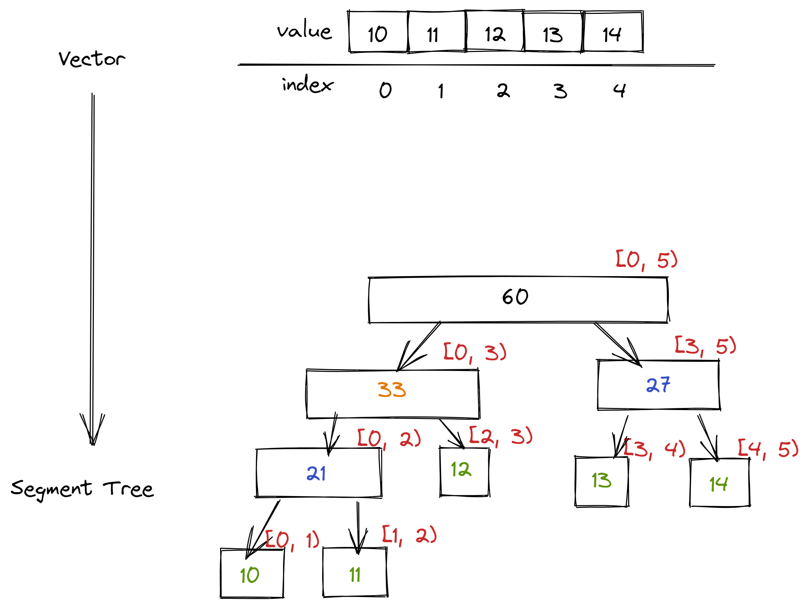

# Segment Tree 




```golang
func build(l, r, p int) {
    if l + 1 == r {
        d[p] = a[l]
        return 
    }

    m := (l + r + 1) / 2
    build(l, m, p * 2 + 1)
    build(m, r, p * 2 + 2)
    d[p] = d[p * 2 + 1] + d[p * 2 + 2]
}
```


