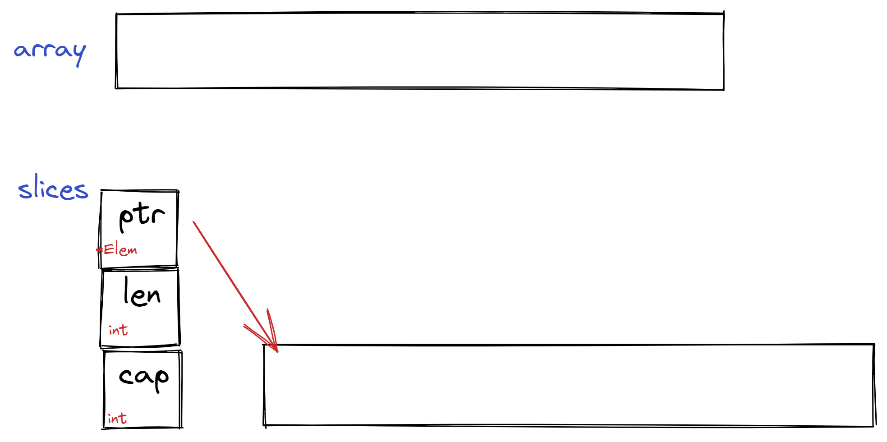

# Array and Slices

[go blog slices](https://go.dev/blog/slices)


## Array 

> Arrays are not often seen in Go programs because the size of an array is part of its type, which limits its expressive power.

> "数组大小也是数组类型的一部分，所以数组很弱小"

```go
var buffer [256]byte
```

- 大小也是Array类型的一部分
- Array在内存中连续
- `len(buffer)`可以返回其大小


## Slices

### Basical

> A slice describes a piece of an array

> ”切片是数组片段的描述“


```go
var slice []byte = buffer[100:150]
```

切片像是存储了长度和数组元素指针的数据结构，原理类似下面的代码

```go
type sliceHeader struct {
    Length        int
    ZerothElement *byte
}

slice := sliceHeader{
    Length:        50,
    ZerothElement: &buffer[100],
}
```

切片的切片 `slice2 := slice[5:10]`大致原理如下

```go
slice2 := sliceHeader{
    Length:        5,
    ZerothElement: &buffer[105],
}
```

*slices header* 真的存储了一些slice的变量，某些函数调用时候就用到了这些变量

```go
slashPos := bytes.IndexRune(slice, '/') 
```


### Passing slices to functions

> It’s important to understand that even though a slice contains a pointer, it is itself a value. Under the covers, it is a struct value holding a pointer and a length. It is not a pointer to a struct.

> " 切片包含指针，但是其本身是一个包含指针和长度的结构体，不是指向结构体的指针。”

```go
func SubtractOneFromLength(slice []byte) []byte {
    slice = slice[0 : len(slice)-1]
    return slice
}

func main() {
    fmt.Println("Before: len(slice) =", len(slice))
    newSlice := SubtractOneFromLength(slice)
    fmt.Println("After:  len(slice) =", len(slice))
    fmt.Println("After:  len(newSlice) =", len(newSlice))
}
```

```bash
Before: len(slice) = 50
After:  len(slice) = 50
After:  len(newSlice) = 49

Program exited.
```

```go
func PtrSubtractOneFromLength(slicePtr *[]byte) {
    slice := *slicePtr
    *slicePtr = slice[0 : len(slice)-1]
}

func main() {
    fmt.Println("Before: len(slice) =", len(slice))
    PtrSubtractOneFromLength(&slice)
    fmt.Println("After:  len(slice) =", len(slice))
}
```

```bash
Before: len(slice) = 50
After:  len(slice) = 49

Program exited.
```


### Cap 

我们可以在一个切片的cap范围内扩大切片

```go
func Extend(slice []int, element int) []int {
    n := len(slice)
    slice = slice[0 : n+1]
    slice[n] = element
    return slice
}

func main() {
    var iBuffer [10]int
    slice := iBuffer[0:0]
    for i := 0; i < 20; i++ {
        slice = Extend(slice, i)
        fmt.Println(slice)
    }
}
```
上面程序的结果

```bash
[0]
[0 1]
[0 1 2]
[0 1 2 3]
[0 1 2 3 4]
[0 1 2 3 4 5]
[0 1 2 3 4 5 6]
[0 1 2 3 4 5 6 7]
[0 1 2 3 4 5 6 7 8]
[0 1 2 3 4 5 6 7 8 9]
panic: runtime error: slice bounds out of range [:11] with capacity 10

goroutine 1 [running]:
main.Extend(...)
	/tmp/sandbox1122970189/prog.go:16
main.main()
	/tmp/sandbox1122970189/prog.go:27 +0xbf

Program exited.
```
> The Capacity field is equal to the length of the underlying array.

> ”切片的容量是底层数组的大小“

所以一个切片的Header更像是下面的结构体
```go
slice := sliceHeader{
    Length:        0,
    Capacity:      10,
    ZerothElement: &iBuffer[0],
}
```



## copy
```go
// copy(dst, src []Type) int
newSlice := make([]int, len(slice), 2*cap(slice))
copy(newSlice, slice)
```

## append

[where is append implementation](https://stackoverflow.com/questions/31790311/where-is-append-implementation)

go(version 1.18)语言中append的增长策略
[runtime/slice.go](https://github.com/golang/go/blob/go1.18/src/runtime/slice.go)

```go
// go version 1.18
	newcap := old.cap
	doublecap := newcap + newcap
	if cap > doublecap {
		newcap = cap
	} else {
		const threshold = 256
		if old.cap < threshold {
			newcap = doublecap
		} else {
			// Check 0 < newcap to detect overflow
			// and prevent an infinite loop.
			for 0 < newcap && newcap < cap {
				// Transition from growing 2x for small slices
				// to growing 1.25x for large slices. This formula
				// gives a smooth-ish transition between the two.
				newcap += (newcap + 3*threshold) / 4
			}
			// Set newcap to the requested cap when
			// the newcap calculation overflowed.
			if newcap <= 0 {
				newcap = cap
			}
		}
	}
```

## Nil

一个nil的切片表现如下

```go
sliceHeader{
    Length:        0,
    Capacity:      0,
    ZerothElement: nil,
}
```

```go
sliceHeader{}
```

但是长度为0的切片可不一样

```go
array[0:0]
```

## String

>Strings are actually very simple: they are just read-only slices of bytes with a bit of extra syntactic support from the language.


