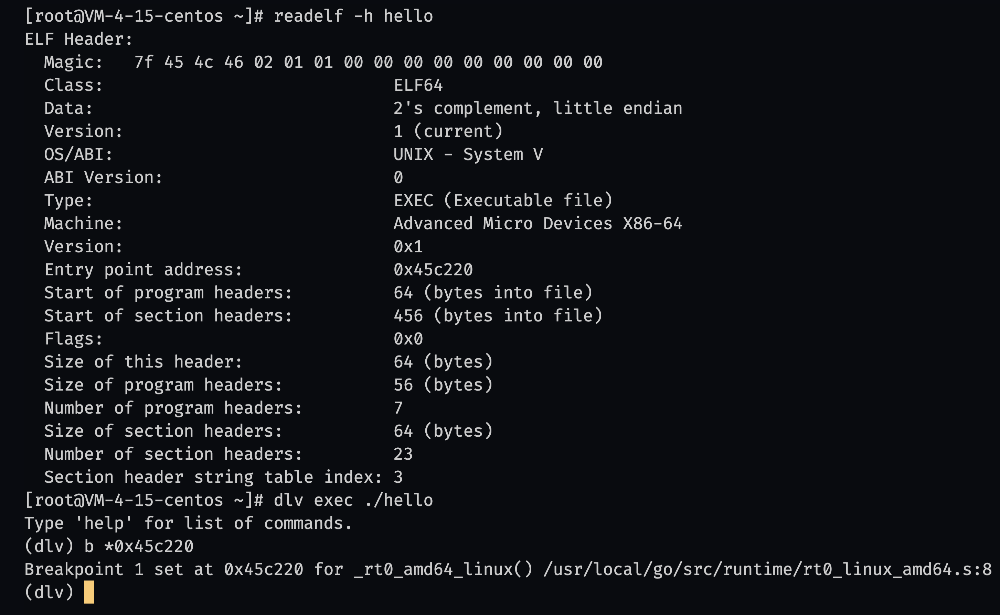

# 0 

### 0.0.1 Install

1. 使用[wget](https://wangchujiang.com/linux-command/c/wget.html)在[golang官网](https://go.dev/dl/) 下载安装包

2. 按照[指导](https://go.dev/doc/install)安装

### 0.0.2 run  

1. `readelf -h ./x` 读取 [ELF](https://github.com/corkami/pics/blob/28cb0226093ed57b348723bc473cea0162dad366/binary/elf101/elf101.pdf) 文件头部内容，使用[dlv](https://github.com/go-delve/delve)调试go程序

2. 将程序加入搜索路径`export PATH=$PATH:/usr/local/go/bin`

