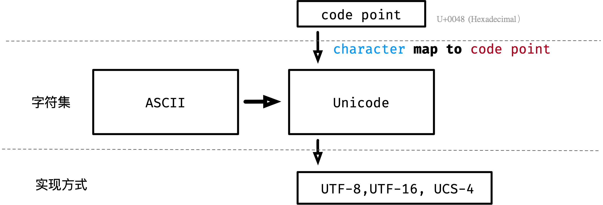

# [Strings, bytes, runes and characters in Go](https://go.dev/blog/strings)

## 引用

[The Absolute Minimum Every Software Developer Absolutely, Positively Must Know About Unicode and Character Sets (No Excuses!)](https://www.joelonsoftware.com/2003/10/08/the-absolute-minimum-every-software-developer-absolutely-positively-must-know-about-unicode-and-character-sets-no-excuses/)

> It does not make sence to have a string without knowing what encoding it using.

> In Go, a string is in effect a read-only slice of bytes.
