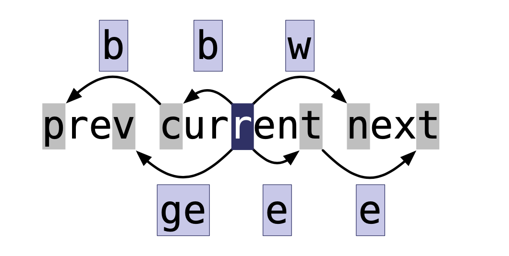

**[--BACK--](../README.md)**

---

## Vim的哲学
**Operator + Number + Motion**

**Think like a Scrabble player**: choose less common characters


## 第一部分


### 第三章：插入模式

#### 技巧13

| 按键操作 | 用途           |
| -------- | -------------- |
| `<C-h>`  | 删除前一个字符 |
| `<C-w>`  | 删除前一个单词 |
| `<C-u>`  | 删至行首       |


#### 技巧14

| 按键操作 | 用途                    |
| -------- | ----------------------- |
| `<Esc>`  | 切换到普通模式          |
| `<C-[>`  | 切换到普通模式          |
| `<C-o>`  | 切换到**插入-普通模式** |

- **插入-普通模式**：只执行一次普通模式的命令，然后返回到插入模式。(这个键在我的Vim配置中被占用了QAQ)

#### 技巧15 + 50

| 命令      | 用途                                           |
| --------- | ---------------------------------------------- |
| `f{char}` | 正向移动到下一个`{char}`所在处                 |
| `F{char}` | 反向移动到上一个`{char}`所在处                 |
| `t{char}` | 正向移动到下一个`{char}`所在处之前的一个字符上 |
| `T{char}` | 反向移动到上一个`{char}`所在处之后的一个字符上 |
| `;`       | 重复上次的字符查找命令                         |
| `,`       | 反转方向查找上次的字符查找命令                 |


| 命令                   | 用途                                         |
| :--------------------- | -------------------------------------------- |
| `<C-r>{register}`      | 插入寄存器`{register}`内的内容               |
| `<C-r><C-p>{register}` | 按照原来的格式插入寄存器`{register}`内的内容 |

- 上述两种命令组合加上`y`这个命令，可以执行复制一些文本，然后插入的操作

#### 技巧 16

`<C-r>=6*35<CR>`：可以直接计算出`6*35`，利用的是`=`寄存器

#### 技巧17 + 18

- `Vim`使用的是`Unicode`编码

| 按键操作              | 用途                                         |
| --------------------- | -------------------------------------------- |
| `<C-v>{123}`          | 以十进制字符编码插入字符                     |
| `<C-v>u{1234}`        | 以十六进制字符编码插入字符                   |
| `<C-v>{nondigit}`     | 按原义插入非数字字符                         |
| `<C-k>{char1}{char2}` | 插入以**二合字符**`{char1}{char2}`表示的字符 |

**二合字符`<C-k>`**

- 将光标移动到字符上，按下`gc`，屏幕下方会显示这个字符的十进制、十六进制、二合表示
- `:h digraph-table`命令可以查看字符的各种表示
- 例如`¿`，的十六进制表示是`{00bf}`，二合表示是`?I`

#### 技巧 19

`R`：替换模式，是按字符替换，所以制表符会被当成一个字符（会更具`expandtab`和`softtabstop`的设置而发生变化）

`gR`：虚拟替换模式，按显示替换，制表符会当成很多个空格

`r & gr`：一次性版本

- 在替换模式下使用**回车**效果很好

### 第四章：可视模式

#### 技巧 20 + 21

**技巧20的名字竟然叫做   “深入理解可视模式”**

- ` Vim`的可视模式是选中文本然后进行命令操作
- 一般的编辑器是选中文本，下一个操作直接是替换文本为按下的字符
- `Vim`中的这种模式被称为**选择模式**，在**可视模式**下按下`<C-g>`进入

`viw`：进入选择模式，然后选中光标所在的单词

| 按键操作 | 用途（可视模式再按一遍会回到普通模式） |
| -------- | -------------------------------------- |
| `v`      | 面向字符的可视模式                     |
| `V`      | 面向行的可视模式                       |
| `<C-v>`  | 面向列块的可视模式                     |
| `o`      | 切换高亮区的活动端                     |
| `gv`     | 重新选择上一次由可视模式选择的文本范围 |
| `e`      | 好像是前进一个单词                     |

#### 技巧 22-26

- 使用`.`
- 使用**操作符命令**大于**可视**命令
- `gU{motion}`：使`{motion}`作用的文本大写
- 列块可视模式修改，在插入模式下只显示第一行，返回普通模式后显示所有行
- `<C-v>$`将选区扩展至每行的行尾

### 第五章：命令行模式

#### 技巧 27

`:h ex-cmd-index`：命令行的命令介绍

| 命令                                            | 用途                                               |
| ----------------------------------------------- | -------------------------------------------------- |
| `:[range]delete[x]`                             | 删除指定范围内的行（到寄存器x）                    |
| `:[range]yank[x]`                               | 复制指定范围的行（到寄存器x）                      |
| `:[line]put[x]`                                 | 在指定行后粘贴寄存器x中的内容                      |
| `:[range]copy{adress}`                          | 把指定范围内的行拷贝到{adress}指定的行下           |
| `:[range]move{adress}`                          | 把指定范围内的行移动到{adress}指定的行下           |
| `:[range]join`                                  | 连接指定范围内的行                                 |
| `:[range]normal {commands}`                     | 对指定范围内的每一行执行普通模式的命令{commands}   |
| `:[range]substitute/{pattern}/{string}/[flags]` | 把对指定范围内出现{pattern}的地方替换为{string}    |
| `:[range]global/{pattern}/[cmd]`                | 把对指定范围内匹配{pattern}的所有行执行Ex命令{cmd} |

#### 技巧 28

- 下列是在命令模式下输入`:`可以选择行号的一些命令

| 符号 | 地址                    |
| ---- | ----------------------- |
| `1`  | 第一行                  |
| `$`  | 最后一行                |
| `0`  | 虚拟行，位于第一行上方  |
| `.`  | 光标所在行              |
| `'m` | 包含位置标记`m`所在的行 |
| `'<` | 高亮选区的起始行        |
| `'>` | 高亮选区的结束行        |
| `%`  | 整个文件`1, $`          |

- 地址的表示形式是`{start},{end}`

- 地址的偏移`{adress} + n`
  - `n`省略默认为`1`，`{adress}`可以是行号，位置标记，或者**查找模式**

#### 技巧 29

| 命令                  | 作用                                  |
| --------------------- | ------------------------------------- |
| `:[range] t {adress}` | 复制`[range]`内的内容到`{adress}`行下 |
| `:[range] m {adress}` | 移动`[range]`内的内容到`{adress}`行下 |

- `t`的复杂版本`copy`或者`co`
- `m`的复杂版本`move`

- `@:`重复上次的命令

| 一些常见用法 |                            |
| ------------ | -------------------------- |
| `:t.`        | 相当于`yyp`                |
| `:'<, '>0`   | 把高亮选区行复制到文件开头 |


## 第二部分

#### 技巧 36

一般使用vim正在编辑的文件是文件的缓冲区`buffer`

| Ex命令                 | 效果                                           |
| ---------------------- | ---------------------------------------------- |
| `:ls`                  |                                                |
| `:bnext`               |                                                |
| `:bprev`               |                                                |
| `:bfirst`              |                                                |
| `:bnext`               |                                                |
| `:buffer N`            |                                                |
| `:buffer {buffername}` |                                                |
| `：bdelete`            | 删除缓冲区，`:bdelete B1 B1` , `:N, M bdelete` |
| `:bufdo`               | 对所有缓冲区同时执行`Ex`命令                   |

#### 技巧 37

**参数列表：** 记录了在`vim`启动时参数传递给`vim`的文件列表


| Ex命令            | 效果 |
| ----------------- | ---- |
| `:args {arglist}` |      |

- `{arglist}` 可以使用通配符匹配一些文件
  - `:args *.*`, `:args **/*.js`
- ``:args `cat .chapter` `` : 可以将`cat`的输出作为`args`的输入


| Ex命令   | 效果                           |
| -------- | ------------------------------ |
| `:next`  |                                |
| `:prev`  |                                |
| `:argdo` | 对所有的缓冲区同时执行`Ex`命令 |


#### 技巧 38

可以启用`hidden`使在`buffer`之间跳转的时候不用保存

或者使用`:next!`

| Ex命令  | 效果     |
| ------- | -------- |
| `:edit` | 可以回滚 |


#### 技巧 39


## 第三部分: 更快的移动及跳转

### 第八章：用命令在文档中移动

#### 技巧47-48

`:h motion.txt`

`Vim`有`屏幕行`和`实际行`的概念

| 动作的作用                   | 屏幕行             | 实际行                 |
| ---------------------------- | ------------------ | ---------------------- |
| left, up, down, right        | `h`, `j`, `k`, `l` | `gh`, `gj`, `gk`, `gl` |
| 行首，行尾，第一个非空白字符 | `0`, `$`, `^`      | `g0`, `g$`, `g^`       |


#### 技巧49



- 上述是基于单词(word)的移动
- 在`Vim`中有连个不同的概念`word`和`WORD`
    - `:h word`, `:h WORD`

| word | WORD |
| ---- | ---- |
| `b`  | `B`  |
| `w`  | `W`  |
| `e`  | `E`  |
| `ge` | `gE` |

#### 技巧51-53

- `Vim`的操作哲学是 **operator + number +
  motion**，在本章中的一些技巧都是`motion`
    - `d{motion}`, `c{motion}`, `v{motion}`
    - 还可以使用查找命令`\`


| 作用                               | 命令 |
| ---------------------------------- | ---- |
| 选择一对分隔符内部的区域           | `i`  |
| 选择一对分隔符内部的区域以及分隔符 | `a`  |


| 可选分隔符                     |
| ------------------------------ |
| `)`                            |
| `}`                            |
| `]`                            |
| `'`                            |
| `"`                            |
| `` ` ``                        |
| `t`:表示xml标签`<xml>tag<xml>` |


| 文本对象 | 选择范围                   |
| -------- | -------------------------- |
| `iw`     | 当前单词(word)             |
| `iW`     | 当前字串(WORD)             |
| `is`     | 当前句子                   |
| `ip`     | 当前段落                   |  | `aw` | 当前单词(word)以及一个空格 |
| `aW`     | 当前字串(WORD)以及一个空格 |
| `as`     | 当前句子以及一个空格       |
| `ap`     | 当前段落以及一个**空行**   |

#### 技巧54:位置标记和跳转

##### 1. 设置标记

|               |                            |
| ------------- | -------------------------- |
| `m{a-zA-Z}`   | 设置位置标记               |
| `` `{mark} `` | 跳转到位置标记所在的行、列 |
| `` '{mark} `` | 跳转到位置标记所在的行     |

- 小写位置标记只在每个缓冲区局部可见
- 大写位置标记则全局可见


##### 2. 自动位置标记

| 位置标记   | 跳转到                           |
| ---------- | -------------------------------- |
| ``` `` ``` | 当前文件中上次跳转动作之前的位置 |
| `` `. ``   | 上次修改的地方                   |
| `` `^ ``   | 上次插入的地方                   |
| `` `[ ``   | 上次修改或复制的起始位置         |
| `` `] ``   | 上次修改或复制的结束位置         |
| `` `< ``   | 上次高亮选区的起始位置           |
| `` `> ``   | 上次高亮选区的结束位置           |


#### 技巧 55

| 命令 | 作用                     |
| ---- | ------------------------ |
| `%`  | 跳转到所匹配的括号的位置 |

- 常常用此功能修改一对括号的样式，例如将`{London Berlin New York}`修改为 `[London Berlin New York]`
    - 使用了``` `` ```


##### Tips

1. *`matchit`随`vim`一起发布，但它缺省并未使能*

```vimrc
" 将这一段内容加入vimrc
set nocompatible
filetype plugin on
runtime macros/matchit.vim
```

2. 推荐一个插件[surround](http://github.com/tpope/vim-surround)


### 第九章：在文件间跳转

#### 技巧56

| 跳转的命令 |     |
| ---------- | --- |
| `<C-o>`    |     |
| `<C-i>`    |     |

**什么是跳转**

- `:jumps`
- 任何大范围的移动都被当成跳转(hjkl, 面向字符和单词的移动不算)

|             |                              |
| ----------- | ---------------------------- |
| `(` / `)`   | 跳到上一句/下一句的开头      |  | `{` / `}` | 跳到上一段/下一段的开头 |
| `H`/`M`/`L` | 跳到屏幕的最上方/中间/最下方 |
| `gf`        | 跳转到光标下的文件名         |
| `<C-]>`     | 跳转到光标下关键字定义之处   |


vim 把 `<Tab>`和`<C-i>`认为是一个东西

#### 技巧57

`:changs`


|      |                    |
| ---- | ------------------ |
| `g;` | 上次进行改变的位置 |
| `g,` | 与上个命令相反     |


| 撤销/反撤销 |
| ----------- |
| `u`         |
| `<C-r>`     |


- 一个缓冲区一个改变列表，一个窗口一个跳转列表

#### 技巧58

`gf` 跳转到文件

```vimrc
" 可以设置一个或多个扩展名字
:set suffixesadd+=.md
```

- 还可以设置`path`，详情请见`:set path`
- 书上有一段没有抄
- 推荐两个插件[ruby](https://github.com/vim-ruby/vim-ruby), [bunlder](https://github.com/tpope/vim-bundler)

#### 技巧59

**注意设置全局标记**
- `m + Upcase_letter`


## 第四部分:寄存器

### 第十章：复制与粘贴

#### 技巧60-61

`"{register}`：可以指定寄存器

- 使用`y{motion}`命令，要复制的文本同时被拷贝进入无名寄存器`""`，和复制专用寄存器`"0`

| 寄存器   | 作用                                                |
| -------- | --------------------------------------------------- |
| `""`     |                                                     |
| `"{a-z}` |                                                     |
| `"0`     |                                                     |
| `"_`     | 黑洞寄存器                                          |
| `"+`     | X11剪切板，用剪切、复制与粘贴命令操作               |
|          | X11主剪切板，用鼠标中键操作(Windows 和 Mac OSX没有) |

- `"+p`：可以粘贴系统剪切板的内容, 插入模式下使用`<C-r>+`


| 只读寄存器                 |                  |
| -------------------------- | ---------------- |
| `"%`                       | 当前文件名       |
| `"#`                       | 轮换文件名       |
| `".`                       | 上次插入的文本   |
| `":`                       | 上次执行的Ex命令 |
| `"/`：(可以通过`:let`改变) | 上次查找的模式   |


#### 技巧62 - 63

- `P` 粘贴到当前位置之前
- `gp` 与`p`作用相同，光标位置在当前位置的结尾而不是开头
- `gP` 与`P`作用相同，光标位置在当前文本位置的结尾而不是开头

#### 技巧 64

懒得看


### 第11章:宏

#### 技巧 65 - 68

- 使用`q{register}`开始录制宏，使用`q`结束录制
- `reg {register}`看`register`中的内容 

---

- `n@{register}`多次执行

---

- Visual多行选中，再`normal @a`可以并行执行


#### 技巧 69


- 使用`q{REGISTER}`加内容在`q{register}`之后。


#### 技巧 70

在一组文件中执行宏，但是我懒得看


#### 技巧 71 

- 一点点vim脚本

```
let i = 0
echo i 
let i += 1
```
- 用来累加

```
let i = 1
qa
I<C-r>=i<CR>)<Esc>
let i += 123
q
```

#### 技巧72 修改宏


- 直接修改宏的寄存器中的内容
    - `put a`
    - 修改内容
    - `"ay$`

