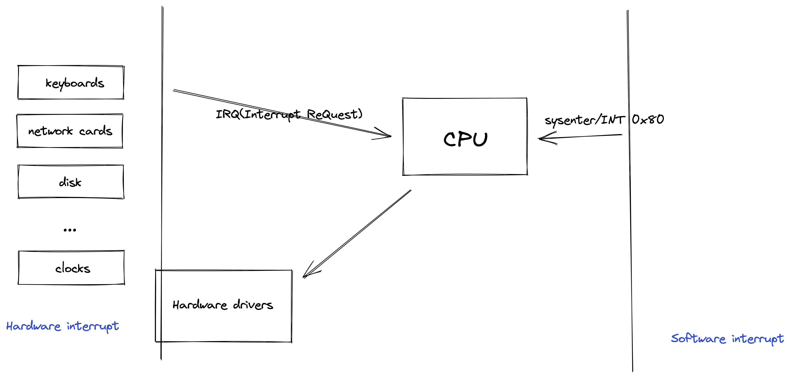

---

1. [linux systemcall table](https://filippo.io/linux-syscall-table/)

2. [debian man page](https://manpages.debian.org/) /
[linux man page online](https://man7.org/linux/man-pages/index.html)

---

[linux Interrupt](https://unix.stackexchange.com/questions/17998/what-are-software-and-hardware-interrupts-and-how-are-they-processed)



一个进程创建需要消耗的资源
- 进程执行时候需要的数据（内存中的数据）
- 进程在创建时会保存页表
- 打开的文件的信息
- 时间，用户组等信息


与进程相关的系统调用的常见使用方法
- 先fork在execve的原因是父亲进程要监控子进程


父进程启动fork函数可以以**相同的内存布局**复制出一个子进程，父进程和子进程同时从fork函数处运行下去
- 创建一个线程可以使用写时复制的方法来减少开销
```c
#include <unistd.h>
/* return:
                         -1 : failer
                          0 : in child process
    cpid (child process id) : in paraent process 
*/
pid_t fork(void);
```
因为fork函数在父进程和子进程中的返回值不一样，所以常常有如下处理


子进程使用execve函数执行其他应用程序，execve函数会**将当前内存的内存布局替换为执行的函数的内存布局**


**当一个进程使用clone函数生成一个子进程，子进程运行参数func指定的函数，当func返回，子进程就会终止。clone产生的子进程和vfork类似，共享父进程的内存，不使用父进程的栈。相反，调用者必须分配一块大小适中的内存空间供子进程的栈使用，同时将这块内存的指针置于参数child_stack 中。在大多数硬件架构中，栈空间的增长方向是向下的，所以参数child_stack应当指向所分配内存块的高端。**

- 栈增长方向对架构的依赖是clone设计的一处缺陷。clone2改善了这个缺陷。


Pthreads线程API内部由clone系统调用实现


