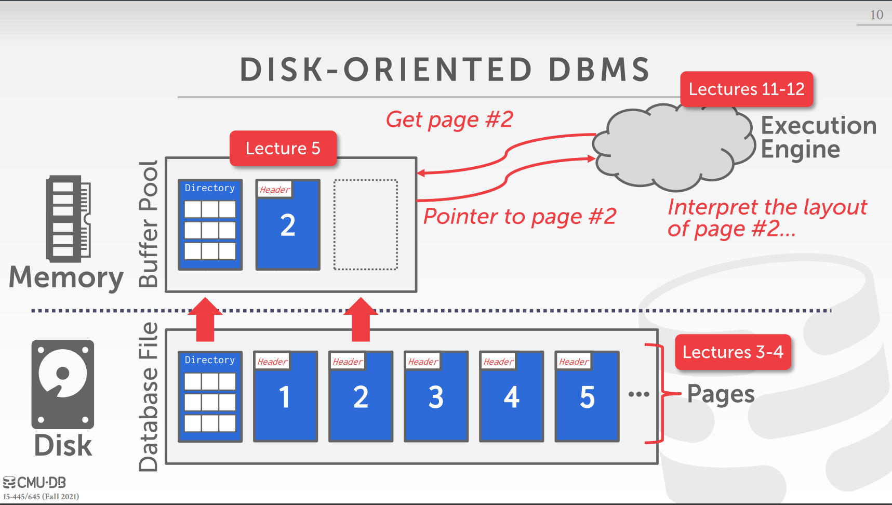
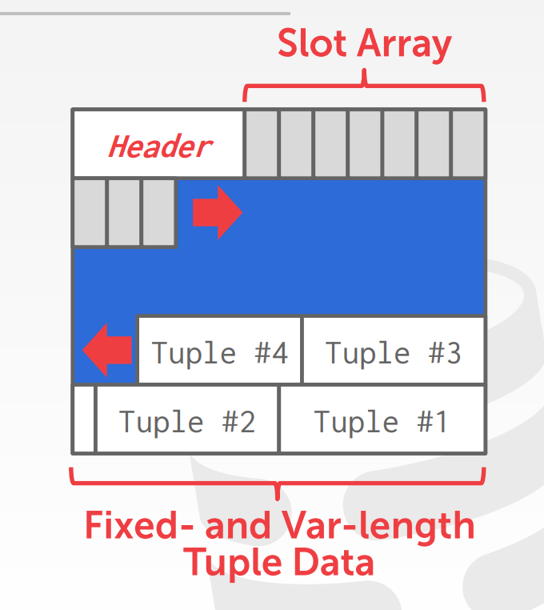
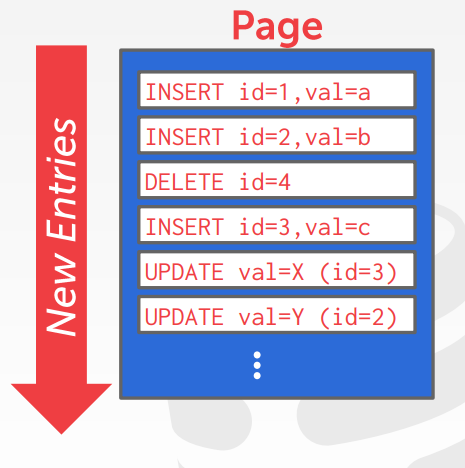
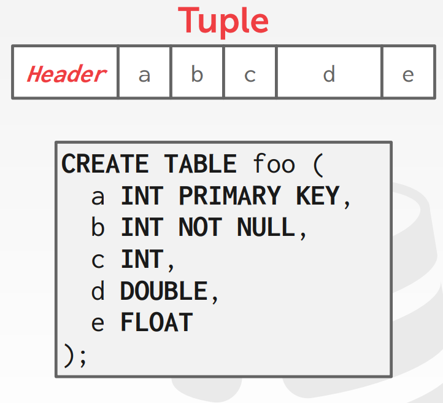
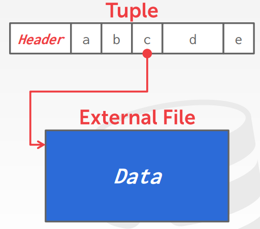
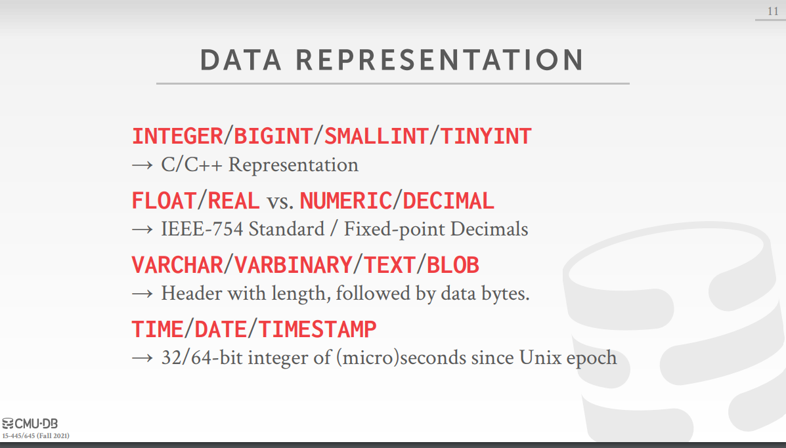
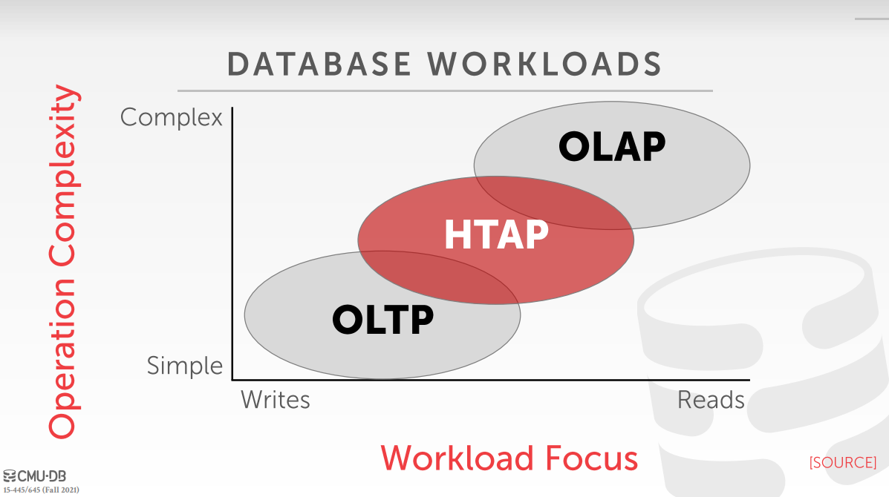

# 数据库系统概论 

## 数据库的存储 

**磁盘作为基础存储的**数据库系统的存储涉及两个问题

1. 数据如何在磁盘上表示(How the DBMS represents the database in files on disk.) 
2. 如何从磁盘和内存之间反复移动数据 (How the DBMS manages its memory and moves data back-and-forth from disk.) 

### 问题一 

#### File Storage

- 使用**buffer pool**的原因是使内存看起来能装下所有的文件。
- 如果操作系统的虚拟内存机制
    - 有可能半页（database page）被换出，需要加锁，影响性能。

#### Page Layout

最少有两种方式存储 Page 

- Tuple-oriented
- Log-structured 

##### Tuple-oriented

##### Log-structured 

*优点*

- 速度块
    - 如果是Tuple-oriented类型的数据库，我们有十条数据要更新，但是十条数据在十个不同的page上，那么我们需要将每一个page读取到内存里，然后再写回去。但是如果是Log-structured类型的数据库，我们只需要将数据添加到一个新的page上。
- 分布式系统常用
    - 分布式系统没法访问每个数据存储的位置，所以采用log的形式追加。[??? 为啥不能访问每个数据的位置]

*缺点*
- 读取慢

#### Tuple Layout

数据库中存储大文件的方法

#### Data Representation

#### 数据库的Workload

**On-Line Transaction Processing (OLTP)**
- Fast operations that only read/update a small amount of data each time.

**On-Line Analytical Processing (OLAP)**

- Complex queries that read a lot of data to compute aggregates.

**Hybrid Transaction + Analytical Processing**
- OLTP + OLAP together on the same database instance

行存储的tuple做OLTP很快，但是做OLAP会读取没用的数据进入内存，浪费资源

### 问题二

#### Buffer Pool Manager

大多数数据库使不使用direct I/O([O_DIRECT](https://linux.die.net/man/2/open))，优点和缺点分别是什么???

#### Replacement Policies

#### Other Memory Pools

## 数据库的索引

维护一些数据
- Dirty Flag: 我们从磁盘中读取page后，page是否被修改
- Pin/Reference Counter: 跟踪当前page的线程数量或者正在查询该page的数量

#### Replacement Policies

#### Other Memory Pools

