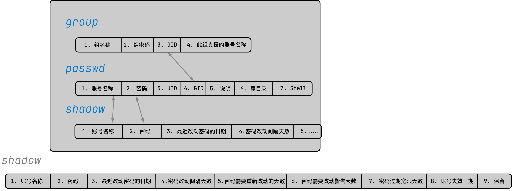
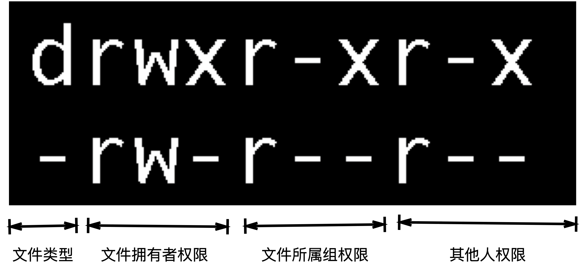

# 说明 
本文档主要用少量语言和较多的图来说明linux的使用方法，并且作者坚信学习linux是边用边学，所以在使用过程中要查阅[linux command](https://wangchujiang.com/linux-command/)

# Bacisal
## linux内核    

[*Linux* kernel](https://www.kernel.org/)

| command | parameter |
| ------- | --------- |
| uname   | -r        |


## Linux 权限

### Users


`/etc`文件夹下的三个文件




| 修改用户权限的命令 | 修改用户组权限的命令 |
| ------------------ | -------------------- |
| useradd            | groupadd             |
| passwd             | groupmod             |
| chage              | groupdel             |
| usermod            | gpasswd              |
| userdel            |                      |
| id                 |                      |
| chfn               |                      |
| chsh               |                      |


### File


一个文件的权限

:

:

> *文件大小为Bytes*

| 文件类型 |                              |
| -------- | ---------------------------- |
| d        | 目录                         |
| -        | 文件                         |
| l        | 连接文件                     |
| b        | 设备文件里可供存储的周边设备 |
| c        | 设备文件里的串行端口设备     |

| 权限类型 |         |
| -------- | ------- |
| r        | read    |
| w        | write   |
| x        | execute |

#### 修改文件权限和属性

- chgrp：修改文件所属用户组
```shell
chgrp [-R] [用户组] dirname/filename
```

- chown
```shell
chown [-R] 账号名称:用户组名称 dirname/filename
```

- chmod 

| chmod   | -                       |
| ------- | ----------------------- |
| u,g,o,a | user, group, other, all |
| +, -, = | 加入，移除，设置        |
| r, w, x |                         |

```shell
rwx = 4 + 2 + 1 = 7

chmod 777 .bashrc
```

```shell
chmod u=rwx, go=rx .bashrc
chmod a+w .bashrc
chmod a-x .bashrc
```

##### 文件权限和目录权限

| -   | file         | directory  |
| --- | ------------ | ---------- |
| r   | 读取文件内容 | 读取文件名 |
| w   | 修改文件内容 | 修改文件名 |
| x   | 执行文件     | 进入目录   |

- 如果你拥有一个目录的权限，但是没有其中文件的权限，可以删除文件
- 读取一个目录里的文件，一般至少需要目录的rx权限

[linux的文件放置标准FHS](https://zh.wikipedia.org/wiki/%E6%96%87%E4%BB%B6%E7%B3%BB%E7%BB%9F%E5%B1%82%E6%AC%A1%E7%BB%93%E6%9E%84%E6%A0%87%E5%87%86)


或许可以挑战一下 [Filesystem Hierarchy Standard 3.0](https://wiki.linuxfoundation.org/lsb/fhs-30) 的阅读

*/usr是UNIX Software Resource*


- 一张Filesystem Hierarchy Standard的图片


:


