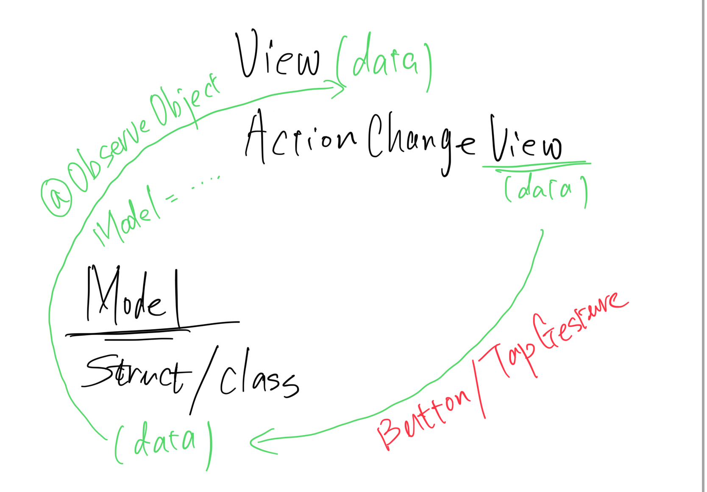

## 参考资料

best teacher https://chat.openai.com/

https://www.swift.org/

swiftUI 用一个例子来告诉你概念的教程  https://developer.apple.com/tutorials/swiftui 

swiftUI 比较详细讲概念的教程  https://developer.apple.com/tutorials/swiftui-concepts 

中文官方关于swift的介绍 https://developer.apple.com/cn/swift/

官方swift语言的资源 https://developer.apple.com/cn/swift/resources/

WWDC视频 https://developer.apple.com/videos/

WWDC student change award https://www.wwdcscholars.com/

Stanford Swift & SwiftUI Course Homepage https://cs193p.sites.stanford.edu/

[apple spatial](./apple-spatial.md)

SwiftUI的并发 https://developer.apple.com/cn/news/?id=o140tv24

## Swift 基本语法

swift 基本的用法我都放在这个 文件里

[w.swift](w.swift)

1. SwiftUI的并发是如何处理的  https://developer.apple.com/cn/news/?id=o140tv24

# 框架(framework)

## AVKit

https://developer.apple.com/documentation/avkit

## AVFoundation

## iOS和SwiftUI

[develop app for ios](developAppForIos)  markdown文件 ->  https://developer.apple.com/tutorials/app-dev-training

首先有一个页面布局（View），然后有改变布局的触发条件(ActionChangeView)，当我们改变布局的时候，其实是改变了一些数据，我们将这些数据封装在一些结构体或者类中(Model)，然后我们把类的实例(data)，传给View，当我们改变，我们实际上用ActionChangeView调用了类里面改变数据的函数，这些被改变的数据实际上被赋予@publish等属性，这样在这些数据被改变之后，我们的页面布局被重新渲染，同时我们也会有一些与后端交互的函数。这个模型叫做(MVVM, ModelView ViewMdel)

细节来讲: 

|    相关文章   |
|-------|
| [单个数据流](https://developer.apple.com/tutorials/app-dev-training/managing-data-flow-between-views) |
| [类数据流](https://developer.apple.com/tutorials/app-dev-training/making-classes-observable) |
| [managing model data](https://developer.apple.com/documentation/swiftui/managing-model-data-in-your-app) |

@State 和 @Bind 都用于单一数据类型，父是 @State 子是 @Bind 
@ObservedObject @StateObject @EnvironmentObject 用于类，父是 @ObservedObjected 子是 @StateObject 孙是 @EnvironmentObject。Class 必须适应 ObservableObject 类

1. layerout

LazyHStack LazyVStack LazyHGrid LazyVGrid **Grid** ScrollView **ViewThatFit** **Form** **List** **OutlineGroup** **DisclousureGroup** **ZStack** **Geometry Reader**

2. modifier

.background  .overlay .padding .aspectRatio

swiftUI中什么是@ViewBuilder

3. animation

SwiftUI 关于animation的文章 https://fatbobman.com/zh/posts/the_animation_mechanism_of_swiftui/
