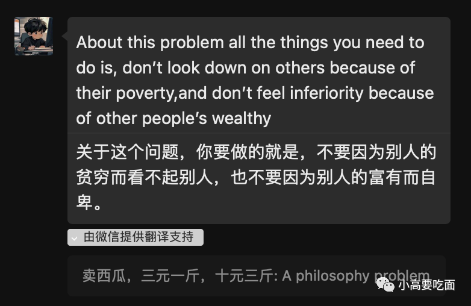

# 看到与做到不一样。不卑不亢。

上一篇文章中写了看华哥的课程，觉得自己理解了，最近又回看，觉得差的太远太远。

今天游泳回来，路上有一些饿，想了一下，自己究竟是买牛奶+水果还是买喜茶喝，因为忽然发现喜茶一杯接近30块钱，而牛奶一箱才60块钱。纠结的点是觉得自己有一些浪费了，我的父母对于30块钱肯定会好好考虑，而我“出手阔错”；而且这个世界上喝不起喜茶的人大有人在，最后自己还是点了一杯，但是感觉非常内疚。遂问我朋友，我朋友告诉我：

我觉得这是一个极好的答案，其实我很多年都一直都知道这件事，但是最近两年却心浮气躁，对于财富量级远大于我的人及其崇拜，对于一些比较穷的人又感到十分怜悯。这是一个完完全全错误的心态。妨碍进步，同时不能让人更好的面对自己。

*2023.07.22*
