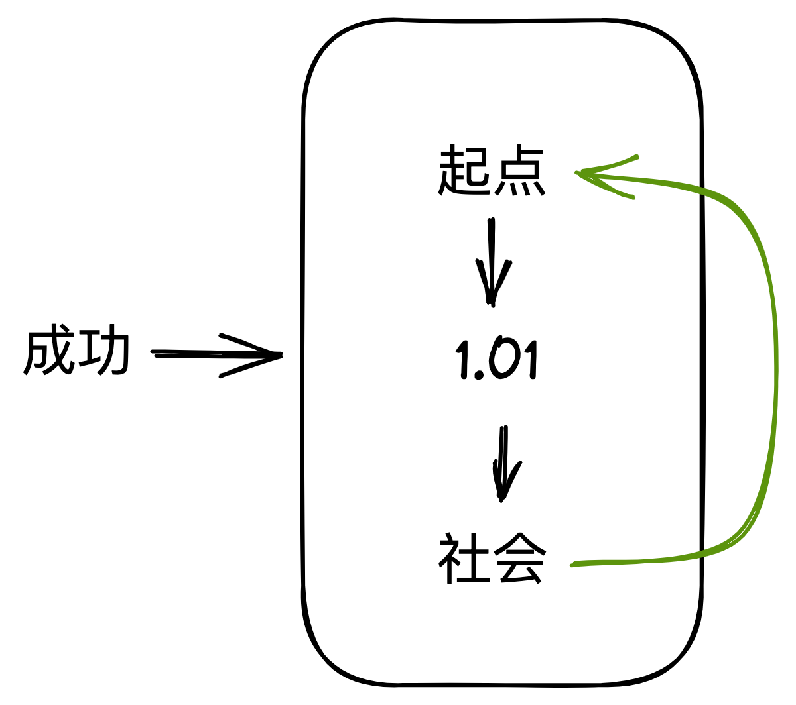
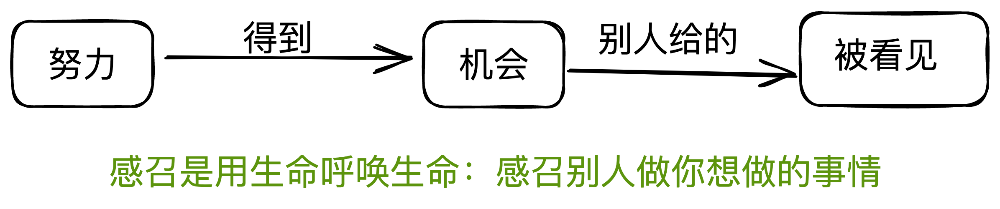

# 职场认知训练营

- 知识是非常廉价的，重要的是行动

## 1. 成功背后的根本逻辑

知识完全不等同与认知

*知识有行动，出现结果。被行动和结果验证后的才是认知*

*通过采访去了解一个人, 一手的故事是最重要的*

// TODO : 看看湖畔大学的视屏     
// TODO : 看看张一鸣的微博       
// TODO : 看张一鸣和王兴的视屏    

成功是什么，成功是一系列的正反馈

<strike> // TODO : 看看[许单单奋斗记](http://tech.sina.com.cn/i/2012-02-04/11306683283.shtml) </strike>

真正重要的是机会，一切的努力是为了得到一个机会。百万年薪是结果，是努力得不来的。

> 自己的总结：什么是机会，拥有资源的地方，是提升自己的地方。

和学历无关的行业是绩效显性的行业

*重新定义打工人 -> **你是你自己公司的CEO***

公司付钱买的不是你的时间，是你的交付

劳动合同不是卖身契

职业规划，发展个人无限责任公司，个人值多少钱，就是你提供的服务(交付物品)值多少钱。

> 有人毕业就可以独挡一面，两年可以成为事业部总经理，而有人毕业10年还要想办法靠跳槽溢价。区别其实很早就开始体现了。  ---   张一鸣

强者思维: 我和公司是平等的，我给公司做了什么，我在公司得到了什么（经验，资源）

// TODO: 看看天道(解说) 或 《遥远的救世主》  
// TODO: 搜集网络上马云的视屏  
// TODO: 搜集网络上马化腾的视屏  
// TODO: 搜集网络上王健林相关的视屏  

## 作业：

### 1. 闻、思、修

- 闻: 我听到了什么
- 思：我有哪些思考
- 修：我要做啥变化

### 2. 开一次小组私人董事会

1. 介绍自己
2. 讲解一遍闻、思、修

-> 产生链接

## 2. 成功的动力是什么

### 讲作业

> "读书没有用，勤奋没有意义"

> "会选择才是真正的能力"

机会不是争取的，机会是别人给的。机会往往青睐有能力的人。

> 人脉：其实你不知道谁是你的人脉，你的贵人

> 为什么别人愿意帮助你，因为你往往帮助过别人

**能力是从做复杂的、困难的、不得心应手的事情来的**

职业规划的灵魂拷问
1. 出卖时间 ?
2. 训练自己 ?

## 5. 换位思考

### 认知非常难以改变，受到了环境的巨大影响

1. 一对做外卖的夫妇，一个月之后，几乎所有时间讨论的事情都是如何抢单子(对我最大的启发
还是要做一些有时间杠杆的事情，如果作计算机程序员，很难有出头之日)
(写一个我与老华的文章)

2. 蔡崇信：没有难过的事情，只有困难的事情。

### 阻挡我们的是我们自己对自己设置的限制，阻碍我们的是别人对我们的看法，真正阻碍我们的是我们如何对待别人对我们的看法

1. 乔布斯12岁的时候给惠普的ceo打电话，乔布斯在演讲中多次提到，这是改变他人生的开启

### 面试

面试官问你7个问题，你问他三个问题

你问面试官的问题的深度，代表你对面试的重视和准备。

面试成功不成功不是你**真正**行不行

>每个人都应该登上属于自己的那座山，看到属于自己的风景

晋升->有潜力

任何事情都有对象和对手（对象和对手都是人）

目标导向三步曲

1. 目标对象是谁 ？
2. 你希望他做什么 ？
3. 你怎么做，他才会做你希望做的 ？

**厉害的人和不厉害的人的差别就是目标导向**

一个咖啡店的店长10k工资，一个咖啡师8k工资。店长做的事情多的多，为啥拿的工资一般。

决定性因素是杠杆，因为一个店长即使比另一个店长优秀，差别只是营业额20w-25w的区别，所以一个店长差别不大。

### 6. 人脉

一切都是基于目标导向，我到底想干什么，我该怎么做。

> 意识到别人可以帮助你

人脉的本质是交换，交换不一定需要平等。

一般人都是帮小忙，人脉是有限的，用完了也就用完了。不要让别人费很大的力气帮你忙，别人的小忙可能就是你的

- 缘：碰到
- 分：接到
