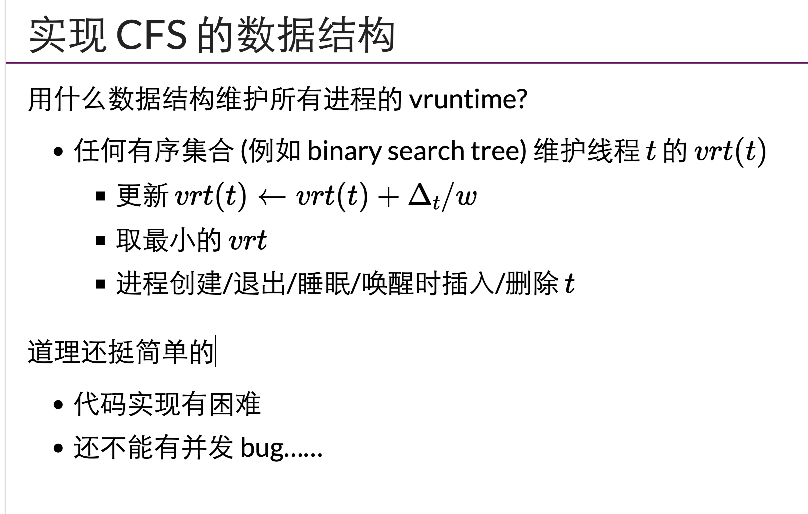

#

### cfs 具体实现中的困难

1. 在真实系统中，被 fork 的子进程如何给已经运行的 cpu 时间，比和父进程一样，比父进程长，比父进程短。
2. 一个 sleep 很久的进程被唤醒，如果给很少的以运行 cpu 时间，会不会被立刻抢钻其他进程的时间。
3. vruntime 如果溢出 64-bit 整数怎么办

```c
void less(u64 a, u64 b)
{
        return (i64)(a - b) < 0;
}
```


